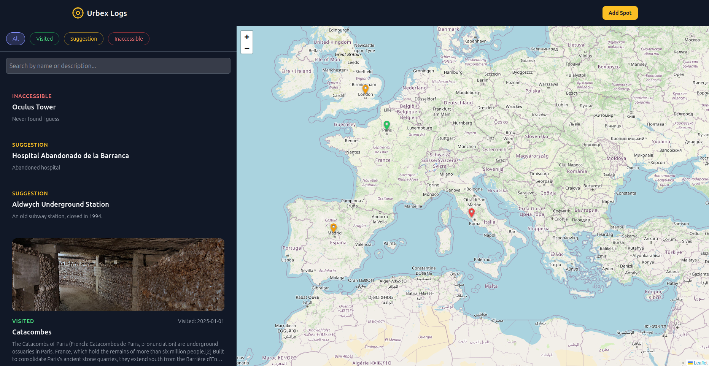

# URBEX MAP

A personnal urbex map to store the places where you went.

<div align="center">
  
</div>

## Features

- **Saving places** : Save all the places you went to with a picture and a description
- **Sharing with others** : Show your favorite urbex locations with your friends
- **Plan your next visits** : Put a special tag on interesting places

## Disclaimers

1. Sharing urbexes sites is not recommended, do not put this on the internet without proper protection

2. Entering private proprieties is illegal, proceed at your own risks

3. This was made mainly with AI, proceed with your own risks again

## How to use

Use this docker compose file to launch the app :

```yaml
services:
  db:
    image: postgres:15
    restart: always
    env_file: ./.env
    volumes:
      - postgres_data:/var/lib/postgresql/data
    networks:
      - urbex-net

  urbex-map:
    image: ghcr.io/your-github-username/urbex-map:latest
    restart: always
    env_file: ./.env
    ports:
      # Expose the application on port 8080
      - "8080:3001"
    volumes:
      - uploads_data:/app/uploads
    depends_on:
      - db
    networks:
      - urbex-net

volumes:
  postgres_data:
  uploads_data:

networks:
  urbex-net:
    driver: bridge
```


## TODO
- Add shortcuts
- Changing the map background
- Spinners for all the loadings
- Add custom tags
- Add markdown to description
- Export and import data with json
- Cluster markers when unzoom
- Add fields (How to enter, dangerosity, dark place...)
- Add stats (how many in a year, regions...)
- Immich / AdventureLog integration ?

